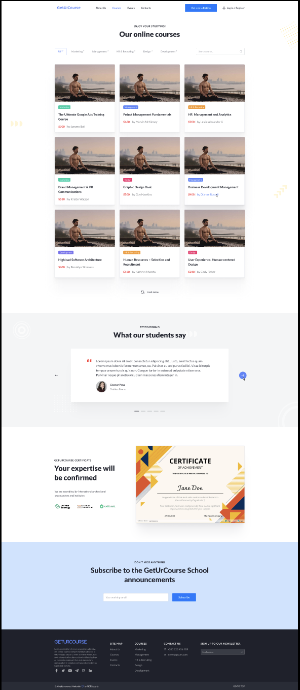

# Розробка прототипу інтерфейсу користувача

Для створення макету було обрано платформу Figma  

## Головна сторінка

## Сторінка курсів

## Сторінка курсу

## Сторінка вчителя 

## Сторінка подій

## Сторінка події

## Сторінка "Про нас"

## Сторінка контактів

## Сторінка реєстрації

## Сторінка авторизації

### Бета тест
Подивитися детально макет можна за цим [посиланням](https://www.figma.com/proto/HhLZGzCgKbPZZXb4BY2spL/GetUrCourse?node-id=6-1735&node-type=canvas&t=ZICwGr4VyvylDGnU-0&scaling=min-zoom&content-scaling=fixed&page-id=0%3A1)  

