#  Розробка базової структури коду

## Підготовка до розробки 
Після аналізу архітектури, use cases та функціональних/нефункціональних вимог було обрано відповідні бібліотеки та сформовані основні вимоги до написання чистого, маштабованого коду за принцами SOLID, CQRS, DRY, KISS та інших парадигм. Через складність реалізації обміну повідомленнями між сервісами за допомогою Kafka та маштабності системи, було обрано RabbitMQ в якості брокеру для спілкування частин платформи. А також цей інструмент допоможе швидше надати MVP проєкту.

## Розробка коду
Для цього етапу виконання роботи було виділено наступні сервіси: 
- Auth Service  
- Payment Service  
- Notification Service  
- Chat Service  
- Course Service
- Task Service  
- User Service    
 
### Auth  
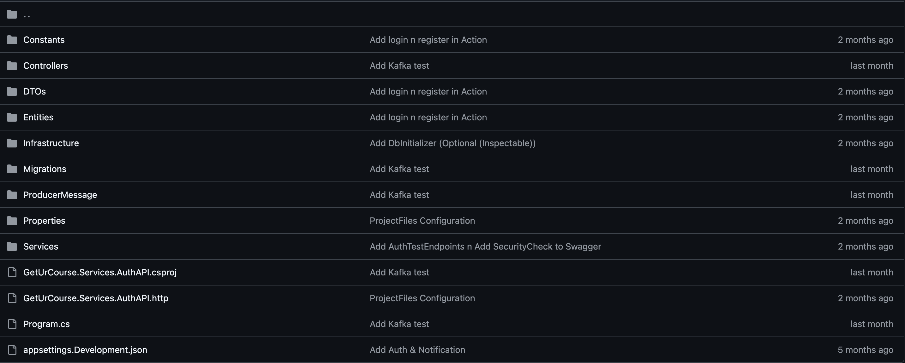

До проекту входять наступні файли та директорії: 
- Program.cs, де знаходяться всі налаштування проекту   
- Controllers, це директорія де можна побачити основну логіку для реєстрації/аутентифікації користувачів системи
- Services, папка в якій є сервіс для реєстрації/аутентифікації
- Entities, тека, де є модель користувача
- DTOs, директорія, в якій містяться моделі для перенесення інформації від користувачів до серверу

### Payment  
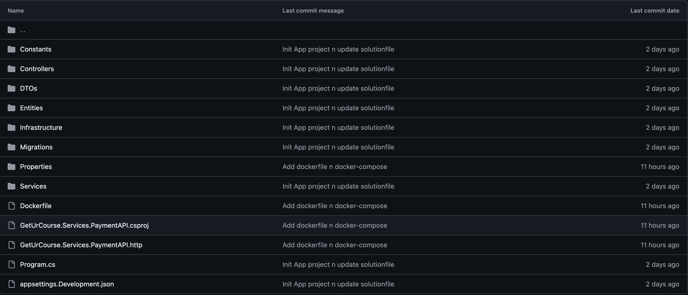

До проекту входять наступні файли та директорії: 
- Program.cs, де знаходяться всі налаштування проекту   
- Controllers, це директорія де знаходиться логіка роботи сплати в системі
- Services, папка в якій є сервіс для роботи з зовнішнім API
- Entities, тека, де є модель умовного чеку після плати 
- DTOs, директорія, в якій містяться моделі для перенесення інформації від користувачів до серверу

### Notification  
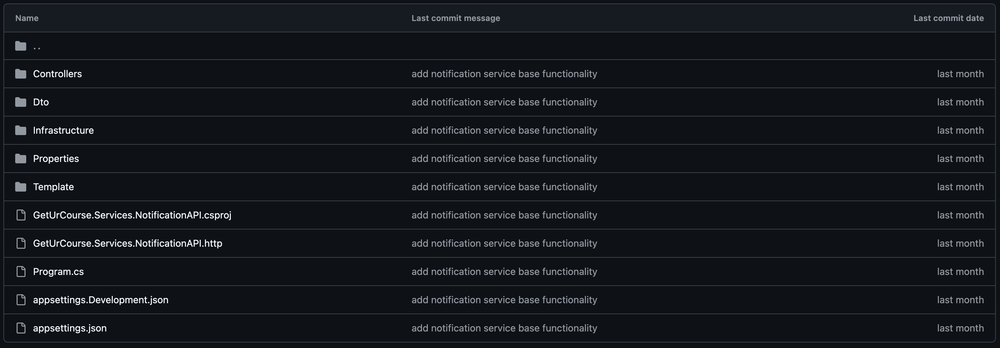

До проекту входять наступні файли та директорії: 
- Program.cs, де знаходяться всі налаштування проекту   
- Controllers, це директорія де є бізнес логіка для відпралення повідомлень користувачам по email
- Infrastructure, папка в якій є сервіси для роботи з зовнішнім API
- Templates, тека, де є всі шаблони для повідомлень, які можуть надходити до користувачів
- DTOs, директорія, в якій містяться моделі для перенесення інформації від користувачів до серверу

### Course  
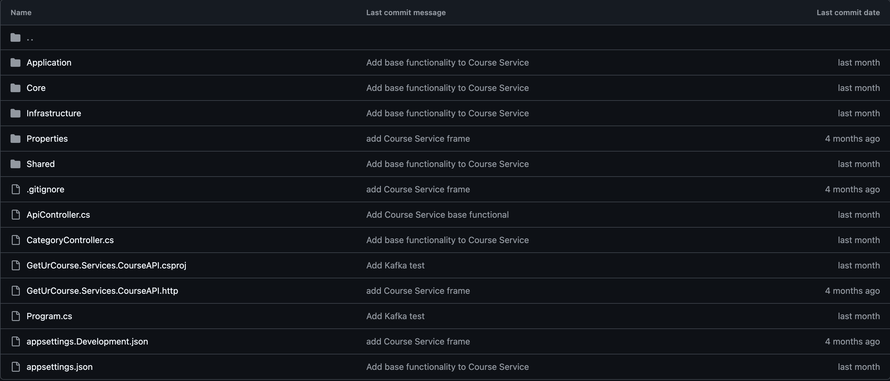

До проекту входять наступні файли та директорії: 
- Program.cs, де знаходяться всі налаштування проекту   
- Core, директорія в якій є доменні моделі сервісу та їх базова бізнес логіка
- Application, тека де є реалізація бізнес логіки з застосування паттерну CQRS та сторонніх сервісів
- Infrastructure, папка, в якій розміщена реалізація доступу до бази данних та кешування 
- Shared, директорія, в якій містяться допоміжні класи сервісу   

### Task  
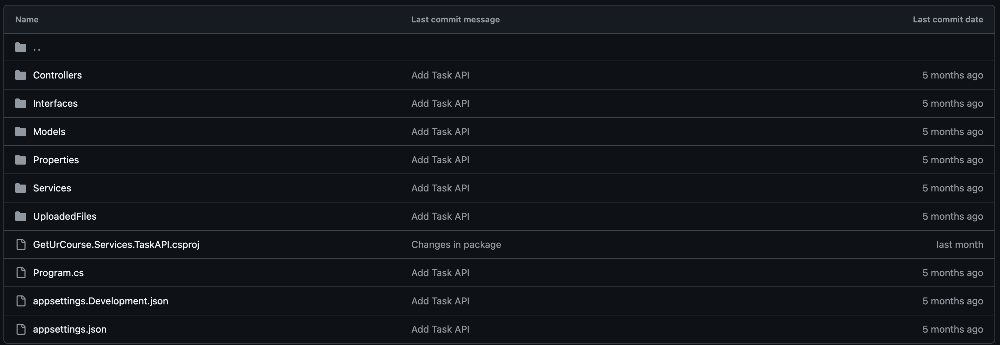

До проекту входять наступні файли та директорії: 
- Program.cs, де знаходяться всі налаштування проекту   
- Controllers, це директорія де можна побачити логіку збереження робіт студентів
- Services, папка в якій є сервіс для завантаження робіт в папку UploadedFiles
- Models, тека, де є модель для файлу, а також dto для отримання інформації про користувача
- Interfaces, директорія, де є інтерфейс для збереження робіт

### User  
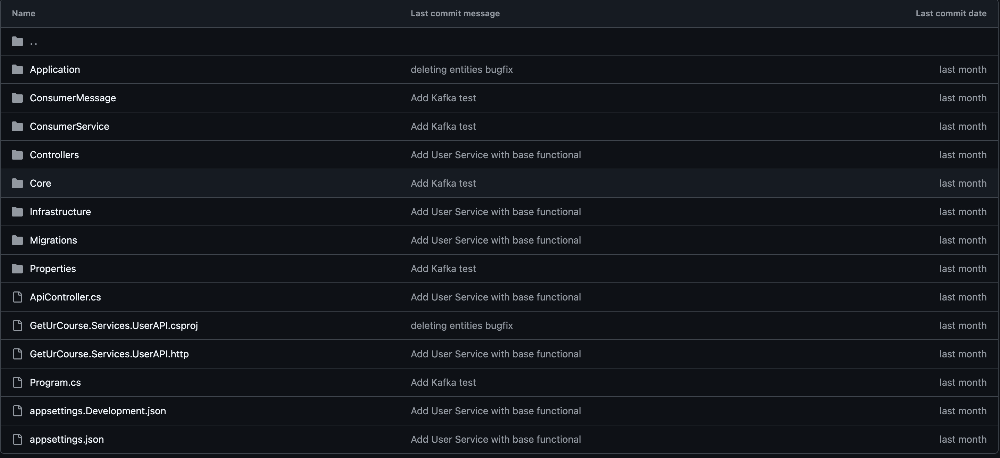

Проект складається з таких файлів і директорій:
- Program.cs — файл, у якому містяться всі налаштування проекту  
- Core — директорія, що містить доменні моделі сервісу та базову бізнес-логіку  
- Application — папка, де реалізована бізнес-логіка з використанням патерну CQRS та інтеграція зі сторонніми сервісами  
- Infrastructure — директорія, яка включає реалізацію доступу до бази даних та механізми кешування  
- Shared — папка з допоміжними класами та утилітами для підтримки роботи сервісу  

### Chat  
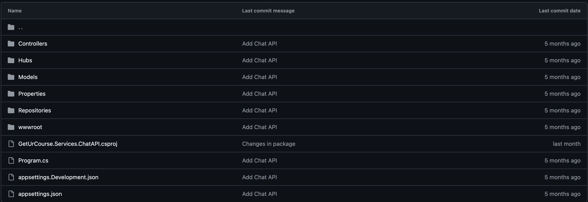

Проект складається з таких файлів і директорій:
- Program.cs, де знаходяться всі налаштування проекту   
- Controllers, це директорія де є бізнес логіка для чату між корисувачами  
- Models, папка в якій є модель повідомлення  
- Repository, тека, де є інтерфейси, які потрібні для бізнес логіки

## Використання Git
Детально з файлами проєкту можна ознайомитися за [посиланням](https://github.com/D0wnfal1/GetUrCourse)

## Опис результатів
Детально розглянемо use case з реєстрацією та аутентифікацією:
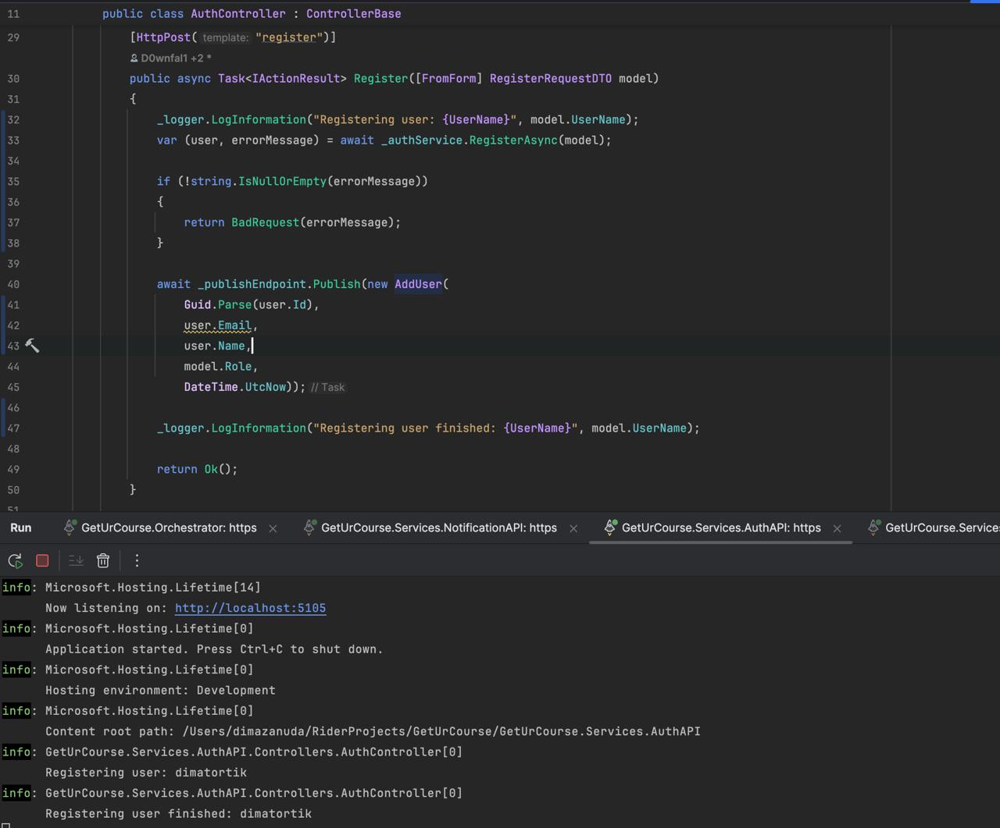
Тут ми можемо побачити, що після того, як користувач зареєструвався викликається метод Publish в який передається AddUser. Ця інформація передається в MassTransit(RabbitMQ). А також відбувається перевірка на те, чи додано користувача до бази даних, та на те чи прийшло повідомлення до кристувача, а перевіряється це все в Saga. Якщо якийсь сервіс перестає працювати, то Saga надсидає компенсуючу транзакцію. 
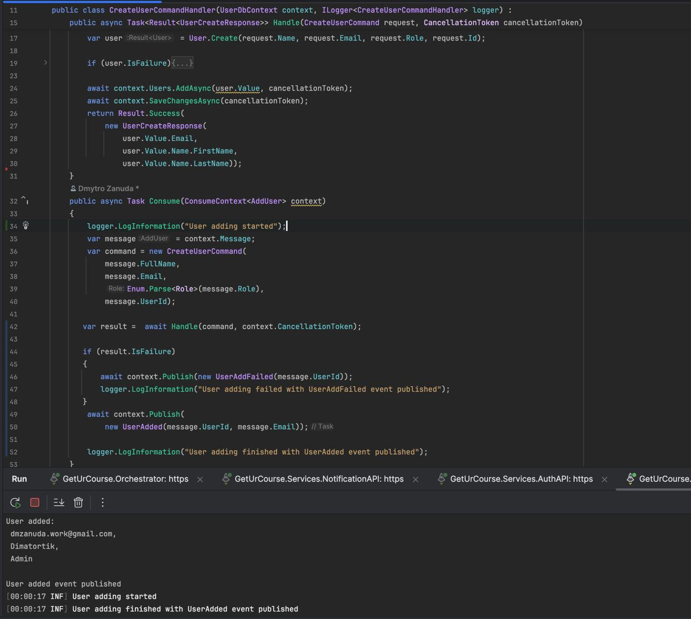
Тут можна побачити, що користувача додано до бази даних і також це можна побачити по логах в консолі. Окрім цього тут видно, що  закінчилася подія додавання користувача.
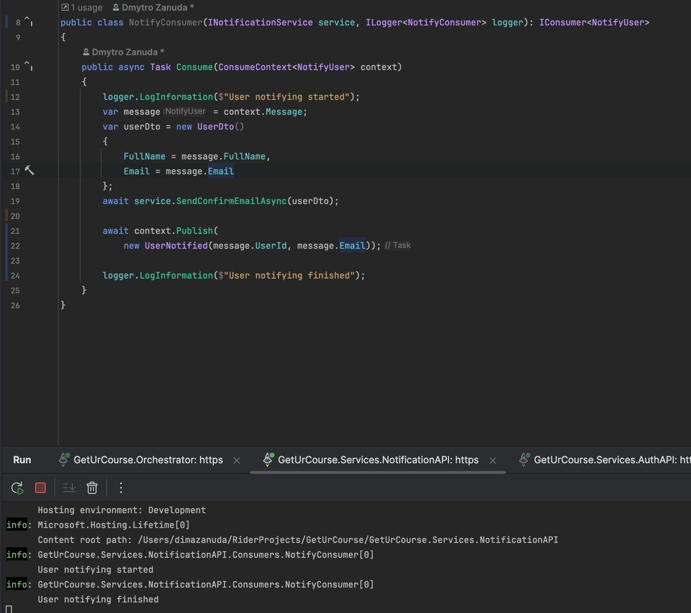
А на цьому скріншоті видно, що користувачу було надіслано email на його пошту. 
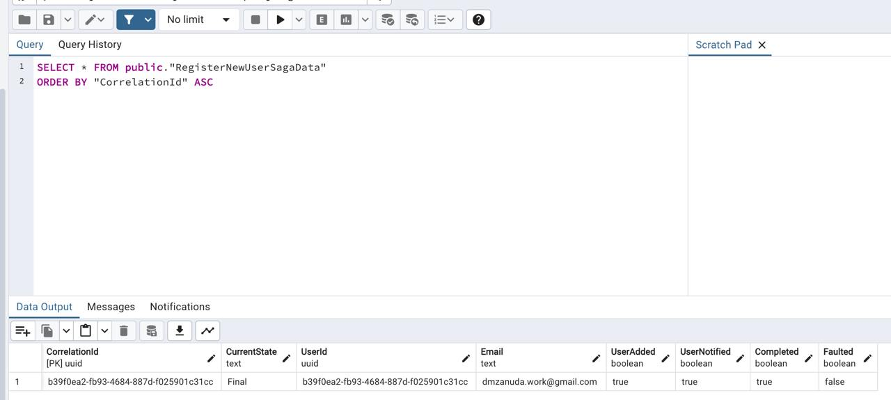
Можна побачити, що в Saga все пройшло та користувача було успішно додано та повідомленно по пошті