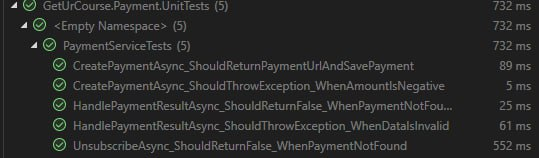
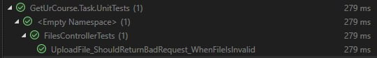
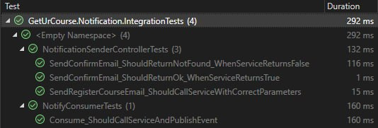
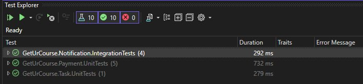

#  Тестування та валідація

Після аналізу всього проєкту та коду було написано відповідні тести, а саме юніт, компонентні та системні.  

## Підготовка до тестування
- Перевірка, що всі компоненти системи завершені та інтегровані.  
- Створення списку функціональних та нефункціональних вимог до системи.  
- Визначення інструментів для проведення тестування (наприклад, Moq та Postman).  

## Юніт-тестування
- Написано тести для ключових модулів та функцій.  
- Провірено коректність обчислень, обробки даних та логіки в функціях.  
- Для автоматизації тестування використовувались Moq та Xunit.  

```csharp
using GetUrCourse.Services.PaymentAPI.Constants;
using GetUrCourse.Services.PaymentAPI.Infrastructure.Repositories;
using GetUrCourse.Services.PaymentAPI.Models;
using Moq;
using Newtonsoft.Json;
using PaymentAPI.Model;
using System;
using System.Collections.Generic;
using System.Text;
using System.Threading.Tasks;
using Xunit;

public class PaymentServiceTests
{
	private readonly Mock<IPaymentRepository> _mockRepository;
	private readonly PaymentService _paymentService;

	public PaymentServiceTests()
	{
		_mockRepository = new Mock<IPaymentRepository>();
		_paymentService = new PaymentService("testPublicKey", "testPrivateKey", _mockRepository.Object);
	}

	[Fact]
	public async Task CreatePaymentAsync_ShouldReturnPaymentUrlAndSavePayment()
	{
		// Arrange
		string orderId = "12345";
		string action = "pay";
		decimal amount = 100.50m;
		string description = "Test Payment";

		_mockRepository.Setup(repo => repo.AddAsync(It.IsAny<Payment>())).Returns(Task.CompletedTask);

		// Act
		var result = await _paymentService.CreatePaymentAsync(orderId, action, amount, description);

		// Assert
		Assert.Contains("https://www.liqpay.ua/api/3/checkout", result);
		_mockRepository.Verify(repo => repo.AddAsync(It.Is<Payment>(p =>
			p.OrderId == orderId &&
			p.Action == action &&
			p.Amount == amount &&
			p.Description == description &&
			p.Status == PaymentSettings.IsCreated
		)), Times.Once);
	}

	[Fact]
	public async Task HandlePaymentResultAsync_ShouldReturnFalse_WhenPaymentNotFound()
	{
		// Arrange
		string orderId = "12345";
		var requestDictionary = new Dictionary<string, string>
		{
			{"data", Convert.ToBase64String(Encoding.UTF8.GetBytes(JsonConvert.SerializeObject(new
			{
				version = "3",
				order_id = orderId,
				status = "success"
			})))},
			{"signature", "testSignature"}
		};

		_mockRepository.Setup(repo => repo.GetByOrderIdAsync(orderId)).ReturnsAsync((Payment)null);

		// Act
		var result = await _paymentService.HandlePaymentResultAsync(requestDictionary);

		// Assert
		Assert.False(result);
	}


	[Fact]
	public async Task UnsubscribeAsync_ShouldReturnFalse_WhenPaymentNotFound()
	{
		// Arrange
		string orderId = "12345";

		_mockRepository.Setup(repo => repo.GetByOrderIdAsync(orderId)).ReturnsAsync((Payment)null);

		// Act
		var result = await _paymentService.UnsubscribeAsync(orderId);

		// Assert
		Assert.False(result);
	}

	[Fact]
	public async Task CreatePaymentAsync_ShouldThrowException_WhenAmountIsNegative()
	{
		// Arrange
		string orderId = "12345";
		string action = "pay";
		decimal amount = -50;
		string description = "Test Payment";

		// Act & Assert
		await Assert.ThrowsAsync<ArgumentException>(() =>
			_paymentService.CreatePaymentAsync(orderId, action, amount, description));
	}

	[Fact]
	public async Task HandlePaymentResultAsync_ShouldThrowException_WhenDataIsInvalid()
	{
		// Arrange
		var requestDictionary = new Dictionary<string, string>
		{
			{"data", "InvalidBase64Data"},
			{"signature", "testSignature"}
		};

		// Act & Assert
		await Assert.ThrowsAsync<FormatException>(() =>
			_paymentService.HandlePaymentResultAsync(requestDictionary));
	}
}
```
Було написано юніт тести для Payment та Task Services. 
- Цей код містить тести для PaymentService (сервісу обробки платежів), реалізовані за допомогою XUnit і Moq. Основні аспекти: Мок об'єкта репозиторію: Використовується Mock IPaymentRepository для імітації методів репозиторію платежів.
- Тестування створення платежів: Метод CreatePaymentAsync перевіряється на генерацію URL для оплати та збереження платежу в репозиторії. Виявлення помилок, наприклад, якщо сума платежу негативна.
- Обробка результатів платежів: Метод HandlePaymentResultAsync перевіряється на обробку результатів платежу, включно з випадками, коли дані некоректні або платіж не знайдено.
- Відписка від платежів: Метод UnsubscribeAsync тестується на поведінку, коли відповідний платіж не знайдено.
- Перевірка викликів: Використовується Verify для перевірки, чи було викликано методи репозиторію з правильними параметрами.

  
По результатам тестування можна побачити, що все проходить успішно.  

``` csharp
using GetUrCourse.Services.TaskAPI.Controllers;
using GetUrCourse.Services.TaskAPI.Interfaces;
using Microsoft.AspNetCore.Http;
using Microsoft.AspNetCore.Mvc;
using Moq;
using System;
using System.IO;
using System.Threading.Tasks;
using Xunit;

public class FilesControllerTests
{
	private readonly FilesController _controller;
	private readonly Mock<IFileService> _mockFileService;

	public FilesControllerTests()
	{
		_mockFileService = new Mock<IFileService>();
		_controller = new FilesController(_mockFileService.Object);
	}

	[Fact]
	public async Task UploadFile_ShouldReturnBadRequest_WhenFileIsInvalid()
	{
		// Arrange
		IFormFile mockFile = null;

		_mockFileService.Setup(s => s.UploadFileAsync(mockFile)).ThrowsAsync(new ArgumentException("File is invalid"));

		// Act
		var result = await _controller.UploadFile(mockFile);

		// Assert
		var badRequestResult = Assert.IsType<BadRequestObjectResult>(result);
		Assert.Equal("File is invalid", badRequestResult.Value);
	}
}
```

Цей код містить тест для контролера FilesController, який обробляє завантаження файлів.
- Мок об'єкта сервісу: Використовується Mock IFileService для імітації методів сервісу файлів.
- Контролер: Тестується метод UploadFile, який приймає файли через IFormFile.
- Тест на некоректний файл: Якщо вхідний файл є null, метод сервісу UploadFileAsync кидає ArgumentException.
- Перевіряється, що контролер повертає BadRequestObjectResult зі значенням повідомлення про помилку.
- Перевірка результатів: Використовується Assert.IsType для перевірки типу відповіді.
- Значення відповіді перевіряється на відповідність очікуваному тексту помилки.
Код зосереджується на негативному сценарії для завантаження файлів, забезпечуючи валідацію вхідних даних і відповідну обробку помилок.  

  
По результатам тестування можна побачити, що все проходить успішно.  

## Тестування компонентів   
- Перевірка взаємодії між модулями та складовими системи.   

```csharp
using Xunit;
using Moq;
using Microsoft.AspNetCore.Mvc;
using GetUrCourse.Services.NotificationAPI.Controllers;
using GetUrCourse.Services.NotificationAPI.Dto;
using GetUrCourse.Services.NotificationAPI.Infrastructure.NotificationService;
using System.Threading.Tasks;

public class NotificationSenderControllerTests
{
	private readonly Mock<INotificationService> _notificationServiceMock;
	private readonly NotificationSenderController _controller;

	public NotificationSenderControllerTests()
	{
		_notificationServiceMock = new Mock<INotificationService>();
		_controller = new NotificationSenderController(_notificationServiceMock.Object);
	}

	[Fact]
	public async Task SendConfirmEmail_ShouldReturnOk_WhenServiceReturnsTrue()
	{
		// Arrange
		var userDto = new UserDto { Email = "test@example.com", FullName = "Test User" };
		_notificationServiceMock.Setup(s => s.SendConfirmEmailAsync(userDto)).ReturnsAsync(true);

		// Act
		var result = await _controller.SendConfirmEmail(userDto);

		// Assert
		Assert.IsType<OkResult>(result);
	}

	[Fact]
	public async Task SendConfirmEmail_ShouldReturnNotFound_WhenServiceReturnsFalse()
	{
		// Arrange
		var userDto = new UserDto { Email = "test@example.com", FullName = "Test User" };
		_notificationServiceMock.Setup(s => s.SendConfirmEmailAsync(userDto)).ReturnsAsync(false);

		// Act
		var result = await _controller.SendConfirmEmail(userDto);

		// Assert
		var notFoundResult = Assert.IsType<NotFoundObjectResult>(result);
		Assert.Equal("Template file not found.", notFoundResult.Value);
	}

	[Fact]
	public async Task SendRegisterCourseEmail_ShouldCallServiceWithCorrectParameters()
	{
		// Arrange
		var userDto = new UserDto { Email = "test@example.com", FullName = "Test User" };
		var courseName = "C# Basics";
		_notificationServiceMock.Setup(s => s.SendRegisterCourseEmailAsync(userDto, courseName)).ReturnsAsync(true);

		// Act
		var result = await _controller.SendRegisterCourseEmail(userDto, courseName);

		// Assert
		_notificationServiceMock.Verify(s => s.SendRegisterCourseEmailAsync(userDto, courseName), Times.Once);
		Assert.IsType<OkResult>(result);
	}
}
```
Цей код містить тести для NotificationSenderController, який обробляє відправлення різних типів email-повідомлень
- Мок сервісу нотифікацій: Використовується Mock INotificationService для імітації методів сервісу відправлення email-повідомлень.
- Методи контролера: SendConfirmEmail: Тестуються два сценарії. Успіх: Сервіс повертає true, контролер відповідає OkResult. Помилка: Сервіс повертає false, контролер відповідає NotFoundObjectResult з текстом "Template file not found." та SendRegisterCourseEmail: Перевіряється, що сервіс викликається з правильними параметрами, а відповідь контролера — OkResult.
- Перевірка відповідей: Використовується Assert.IsType для перевірки типу результату. Для NotFoundObjectResult додатково перевіряється значення відповіді.
- Перевірка викликів: Метод Verify переконується, що сервіс викликаний із очікуваними параметрами у методі SendRegisterCourseEmail.  
  

```csharp
using Xunit;
using Moq;
using GetUrCourse.Services.NotificationAPI.Consumers;
using GetUrCourse.Services.NotificationAPI.Dto;
using GetUrCourse.Services.NotificationAPI.Infrastructure.NotificationService;
using GetUrCourse.Contracts.User;
using MassTransit;
using Microsoft.Extensions.Logging;
using System.Threading.Tasks;

public class NotifyConsumerTests
{
	private readonly Mock<INotificationService> _notificationServiceMock;
	private readonly Mock<ILogger<NotifyConsumer>> _loggerMock;
	private readonly Mock<ConsumeContext<NotifyUser>> _consumeContextMock;
	private readonly NotifyConsumer _consumer;

	public NotifyConsumerTests()
	{
		_notificationServiceMock = new Mock<INotificationService>();
		_loggerMock = new Mock<ILogger<NotifyConsumer>>();
		_consumeContextMock = new Mock<ConsumeContext<NotifyUser>>();
		_consumer = new NotifyConsumer(_notificationServiceMock.Object, _loggerMock.Object);
	}

	[Fact]
	public async Task Consume_ShouldCallServiceAndPublishEvent()
	{
		// Arrange
		var notifyUser = new NotifyUser(Guid.NewGuid(), "test@example.com", "Test User");
		_consumeContextMock.Setup(c => c.Message).Returns(notifyUser);
		_notificationServiceMock.Setup(s => s.SendConfirmEmailAsync(It.IsAny<UserDto>()))
			.ReturnsAsync(true);

		// Act
		await _consumer.Consume(_consumeContextMock.Object);

		// Assert
		_notificationServiceMock.Verify(s => s.SendConfirmEmailAsync(It.Is<UserDto>(
			u => u.Email == notifyUser.Email && u.FullName == notifyUser.FullName
		)), Times.Once);

		_consumeContextMock.Verify(c => c.Publish(It.Is<UserNotified>(
			e => e.UserId == notifyUser.UserId && e.Email == notifyUser.Email
		), default), Times.Once);

		_loggerMock.Verify(
			x => x.Log(
				LogLevel.Information,
				It.IsAny<EventId>(),
				It.Is<It.IsAnyType>((v, t) => v.ToString().Contains("User notifying started")),
				null,
				It.IsAny<Func<It.IsAnyType, Exception, string>>()
			),
			Times.Once);

		_loggerMock.Verify(
			x => x.Log(
				LogLevel.Information,
				It.IsAny<EventId>(),
				It.Is<It.IsAnyType>((v, t) => v.ToString().Contains("User notifying finished")),
				null,
				It.IsAny<Func<It.IsAnyType, Exception, string>>()
			),
			Times.Once);
	}

}
```
Цей код тестує NotifyConsumer, який відповідає за обробку повідомлень типу NotifyUser за допомогою MassTransit.

Моки залежностей:
- Mock INotificationService: Для імітації сервісу нотифікацій.
- Mock ILogger NotifyConsumer: Для перевірки логування.
- Mock ConsumeContext NotifyUser: Для імітації контексту обробки повідомлення.
Тестований метод:
- Consume: Метод, який обробляє повідомлення NotifyUser.
Основні дії тесту:
- Підготовка: Імітація повідомлення NotifyUser. Налаштування повернення true від сервісу нотифікацій.
- Перевірка викликів: Метод сервісу SendConfirmEmailAsync викликається з правильним об'єктом UserDto. Метод Publish викликається для публікації події UserNotified з правильними даними. Логування інформаційних повідомлень (початок і завершення нотифікації).
- Перевірка результатів: Використовуються методи Verify для підтвердження, що потрібні методи викликаються рівно один раз із правильними параметрами.
- Логування: Перевіряється, що логуються повідомлення на початку і в кінці обробки повідомлення.


За результатими тестування в цьому розділі видно, що все працює та проходить успішно.  
## Системне тестування    
- Перевірка головних функцій системи (наприклад реєстрація користувача).  
Детеальне тестування проєкту можна подивитися за [посиланням](https://drive.google.com/file/d/109QIg0GT5WcRkHUx_oivV6VDH0585HmP/view?usp=sharing)  
З відео можна побачити, що брокер та сервіси працюють так як потрібно, тому можна сказати, що системне тестування успішне.

## Завантаження в репозиторій на GitHub  
Детально з файлами проєкту можна ознайомитися за [посиланням](https://github.com/D0wnfal1/GetUrCourse/tree/dev)  